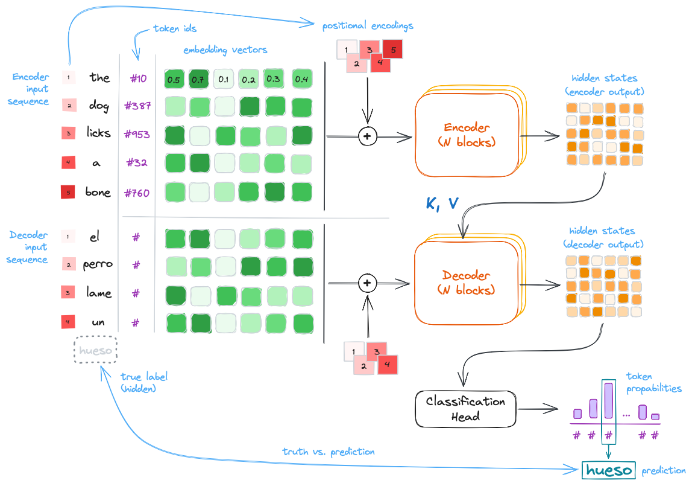

# How Are Large Language Models (LLMs) Built?

<!--

Excalidraw:

```bash
# Log in/out to Docker Hub
docker logout
docker login

# Pull the official image (first time)
docker pull excalidraw/excalidraw

# Start app
docker run --rm -dit --name excalidraw -p 5001:80 excalidraw/excalidraw:latest
# Open browser at http://localhost:5001

# Stop
docker stop excalidraw
docker rm excalidraw
docker ps
```

Blog Post 1: How Are Large Language Models (LLMs) Built?
Subtitle: A Conceptual Guide for Developers

Blog Post 2: Applying Parameter-Efficient Fine-Tuning (PEFT) to a Large Language Model (LLM)
Subtitle: When We Need to Adapt LLMs to Specific Tasks and Domains

Blog Post 3: Retrieval Augmented Generation (RAG) with LLMs: Some Blueprints
Subtitle: How to Use External Knowledge Bases to Enhance LLM Responses

This site chronicles my observations in the fast-evolving landscape of data science.
You'll find my explorations of AI/ML topics spanning computer vision, NLP, 3D, robotics... and more.

This site chronicles my observations in the fast-evolving landscape of data science,
covering topics related to AI/ML, computer vision, NLP, 3D, robotics... and more!
-->
<p align="center">

<small style="color:grey">Large Language Models (LLMs) have been called <a href="https://dl.acm.org/doi/10.1145/3442188.3445922">stochastic parrots</a> by some; in any case, they seem to be here to stay &mdash; and to be honest, I find them quite useful, if properly used. Let's see how they work. Image generated using <a href="https://openai.com/index/dall-e-3/">Dall-E 3</a>; prompt: <i> Wide, landscape cartoon illustration of a happy, confident red-blue-yellow macaw wearing black sunglasses, perched on a tree branch in a green forest, with a white comic speech bubble saying <a href="https://simple.wikipedia.org/wiki/42_(answer)">"42"</a>
.</i>
</small>
</p>


The release of [ChatGPT](https://openai.com/blog/chatgpt) in November 2022 revolutionized our lives in the developed world. In a similar way as Google convinced us that the Internet is useful and we need their search engine or Apple presented the first actually usable smartphone that made the digital world ubiquitous, OpenAI came up with the next logical innovation: assitant chatbots based on Large Language Models (LLMs). Language models existed beforehand, but OpenAI's chat user interface and the emergent capabilities of their models coming from their humongous network and dataset sizes lead to the perfect killer app: the ever-ready genie that *seems* to know the answer to everything, confidently.

> It feels like *"ask ChatGPT"* has become the new *"google it"*.

Current LLMs are based on the **Transformer** architecture, introduced by Google in the seminal work [*Attention Is All You Need* (Vaswani et al. 2017)](https://arxiv.org/abs/1706.03762). Previous to that, [LSTMs or Long short-term memory networks (Hochreiter & Schmidhuber, 1997)](https://en.wikipedia.org/wiki/Long_short-term_memory) used to be state-of-the-art sequence models for Natural Language Processing (NLP). In fact, many of the concepts exploited by the Transformer were developed using LSTMs as the backbone, and one could argue that the LSTM still seems to be a more advanced model that the Transformer itself &mdash; if you'd like an example of an LSTM-based language modeler, you can check this [TV script generator of mine](https://mikelsagardia.io/blog/text-generation-rnn.html).

However, the Transformer presented some major *practical advantages* that enabled a paradigm shift:

- Its *self-attention* module made possible to convert sequential tasks into *parallelizable* ones. 
- Its uncomplicated, modular architecture made it easy to scale up and adapt to *many different tasks*.

Simultaneously, [Howard & Ruder (2018)](https://arxiv.org/abs/1801.06146) demonstrated that *transfer learning* worked not only in computer vision, but also for NLP: they showed that a language model pre-trained on a large corpus could be fine-tuned for smaller corpora and other downstream tasks.

And that's how the way to the current LLMs was paved. Nowadays, Transformer-based LLMs excel in *everything* NLP-related: text generation, summarization, question answering, code generation, translation, and so on.

## The Original Transformer: Its Inputs, Components and Siblings

Before describing the components of the Transformer, we need to explain how text is represented for computers. In practice, text is converted into a **sequence of feature vectors** ${x_1, x_2, ...}$, each of dimension $m$ (the *embedding size* or *dimension*). This is done in the following steps:

1. **[Tokenization](https://en.wikipedia.org/wiki/Large_language_model#Tokenization)**: The text is split into discrete elements called *tokens*. Tokens are units with an identifiable meaning for the model and typically include words or sub-words, as well as punctuation and special symbols.
2. **Vocabulary construction**: A vocabulary containing all $n$ unique tokens is defined. It provides a mapping between each token string and a numerical identifier (token ID).
3. **[One-hot vectors](https://en.wikipedia.org/wiki/One-hot)**: Each token is mapped to its token ID. Conceptually, this corresponds to a one-hot vector of size $n$, although in practice models operate directly on token IDs. In a one-hot vector, all cells have the value $0$ except the cell which corresponds to the token ID of the represented word, which contains the value $1$.
4. **[Embedding vectors](https://en.wikipedia.org/wiki/Word_embedding)**: Token IDs (i.e., one-hot vectors) are mapped to dense embedding vectors using an embedding layer. This layer acts as a learnable lookup table (or equivalently, a linear projection of a one-hot vector), producing vectors of size $m$, with $m \ll n$. These embedding vectors are effectively arrays which contain floating point values. Typical reference values are $n \approx 100{,}000$ and $m \approx 500$.

<p align="center">

<small style="color:grey">A word/token can be represented as a one-hot vector (sparse) or as an embedding vector (dense). Embedding vectors allow to capture semantics in their directions and make possible a more efficient processing. Image by the author.
</small>
</p>

By the way, embeddings can be created for images, too, as I explain in [this post on diffusion models](https://mikelsagardia.io/blog/diffusion-for-developers.html). In general, they have some very nice properties:

- They build up a compact space, in contrast to the sparse one-hot vector space.
- They are continuous and differentiable.
- If the semantics is captured properly, words with close meaning are pointing to similar directions. As a consequence, we can perform arithmetics with them, such that algebraic operations (`+, -`) can be applied to words; for instance, the word `queen` is expected to be close to `king - man + woman`.

<p align="center">

<small style="color:grey">Embeddings can be computed for every modality (image, text, audio, video, etc.); we can even create multi-modal embedding spaces. If the embedding vectors capture meaning properly, similar concepts will have vectors to similar directions. As a consequence, we will be able to apply some algebraic operations on them. Image by the author.
</small>
</p>

<div style="height: 20px;"></div>
<p align="center">── ◆ ──</p>
<div style="height: 20px;"></div>

The original Transformer was designed for language translation tasks and it has two parts:

- The **encoder**, which converts the input sequence (e.g., sentence in English) into hidden states or context.
- The **decoder**, which generates an output sequence (e.g., sentence in Spanish) using as guidance some of the output hidden states of the encoder.

<p align="center">

<small style="color:grey">Simplified architecture of the original <a href="https://arxiv.org/abs/1706.03762">Transformer</a> designed for language translation. Highlighted: inputs (sentence in English), outputs (hidden states and sentence in Spanish), and main parts (the encoder and the decoder).
</small>
</p>

Both the encoder and the decoder are subdivided in `N` blocks each; these blocks pass their hidden state outputs as inputs for the successive ones. Note that for the translation task the encoder input contains the full original text; meanwhile, the decoder produces the output sequence one by one, but it always has the the full encoder hidden state.


## Deep Dive into the Transformer Architecture

<p align="center">

<small style="color:grey">Caption.
</small>
</p>

<p align="center">

<small style="color:grey">Caption.
</small>
</p>


## Where Do We Go from Here?


Links:

- [Attention Is All You Need](https://arxiv.org/abs/1706.03762)
- **[The Illustrated Transformer](https://jalammar.github.io/illustrated-transformer/)**
- **[The Annotated Transformer](https://nlp.seas.harvard.edu/annotated-transformer/)**
- [BERT](https://arxiv.org/abs/1810.04805)
- [GPT](https://openai.com/index/language-unsupervised/)

Other important papers:

- GPT: decoder, generative model.
- BERT: encoder.
- Scaling laws.
- Emergent abilities.
- RLHF: Reinforcement Learning with Human Feedback.
- PEFT: Parameter-Efficient Fine-Tuning.
- RAG: Retrieval Augmented Generation.

<div style="height: 20px;"></div>
<p align="center">── ◆ ──</p>
<div style="height: 20px;"></div>

Expert system for experts.

## Wrapping Up


