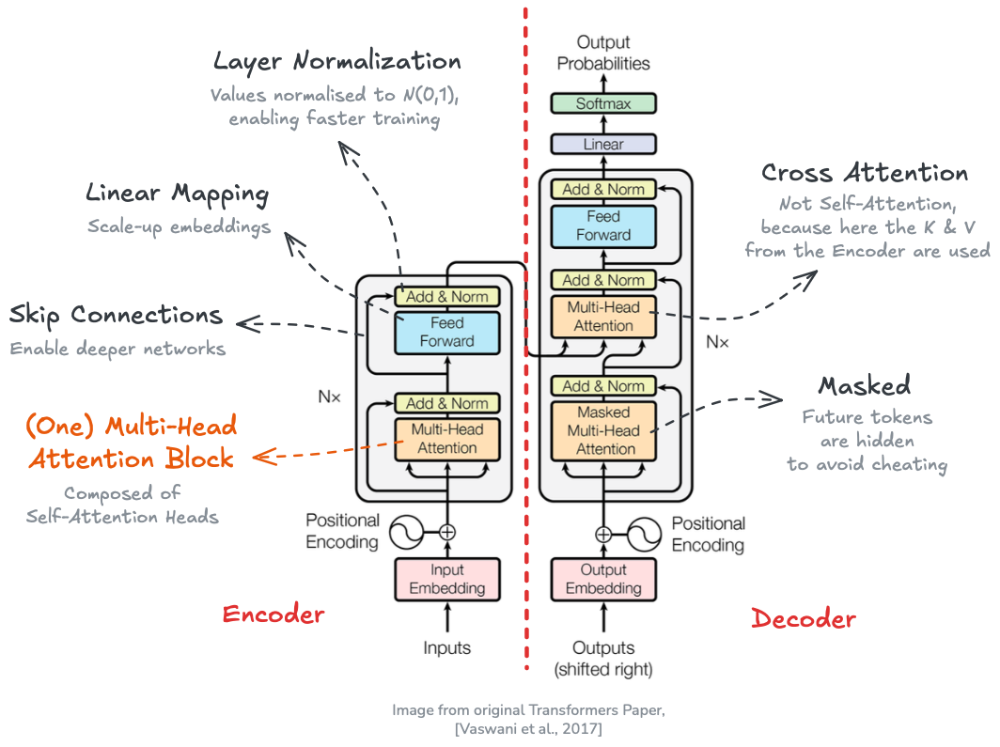

# How Are Large Language Models (LLMs) Built?

<!--

Excalidraw:

```bash
# Log in/out to Docker Hub
docker logout
docker login

# Pull the official image (first time)
docker pull excalidraw/excalidraw

# Start app
docker run --rm -dit --name excalidraw -p 5001:80 excalidraw/excalidraw:latest
# Open browser at http://localhost:5001

# Stop
docker stop excalidraw
docker rm excalidraw
docker ps
```

Blog Post 1: How Are Large Language Models (LLMs) Built?
Subtitle: A Conceptual Guide for Developers

Blog Post 2: Applying Parameter-Efficient Fine-Tuning (PEFT) to a Large Language Model (LLM)
Subtitle: When We Need to Adapt LLMs to Specific Tasks and Domains

Blog Post 3: Retrieval Augmented Generation (RAG) with LLMs: Some Blueprints
Subtitle: How to Use External Knowledge Bases to Enhance LLM Responses

This site chronicles my observations in the fast-evolving landscape of data science.
You'll find my explorations of AI/ML topics spanning computer vision, NLP, 3D, robotics... and more.

This site chronicles my observations in the fast-evolving landscape of data science,
covering topics related to AI/ML, computer vision, NLP, 3D, robotics... and more!
-->
<p align="center">

<small style="color:grey">Large Language Models (LLMs) have been called <a href="https://dl.acm.org/doi/10.1145/3442188.3445922">stochastic parrots</a> by some; in any case, they seem to be here to stay &mdash; and to be honest, I find them quite useful, if properly used. Let's see how they work. Image generated using <a href="https://openai.com/index/dall-e-3/">Dall-E 3</a>; prompt: <i> Wide, landscape cartoon illustration of a happy, confident red-blue-yellow macaw wearing black sunglasses, perched on a tree branch in a green forest, with a white comic speech bubble saying <a href="https://simple.wikipedia.org/wiki/42_(answer)">"42"</a>
.</i>
</small>
</p>


The release of [ChatGPT](https://openai.com/blog/chatgpt) in November 2022 revolutionized our lives in the developed world. In a similar way as Google convinced us that the Internet is useful and we need their search engine or Apple presented the first actually usable smartphone that made the digital world ubiquitous, OpenAI came up with the next logical innovation: assitant chatbots based on Large Language Models (LLMs). Language models existed beforehand, but OpenAI's chat user interface and the emergent capabilities of their models coming from their humongous network and dataset sizes lead to the perfect killer app: the ever-ready genie that *seems* to know the answer to everything, confidently.

> It feels like *"ask ChatGPT"* has become the new *"google it"*.

Current LLMs are based on the **Transformer** architecture, introduced by Google in the seminal work [*Attention Is All You Need* (Vaswani et al. 2017)](https://arxiv.org/abs/1706.03762). Previous to that, [LSTMs or Long short-term memory networks (Hochreiter & Schmidhuber, 1997)](https://en.wikipedia.org/wiki/Long_short-term_memory) used to be state-of-the-art sequence models for Natural Language Processing (NLP). In fact, many of the concepts exploited by the Transformer were developed using LSTMs as the backbone, and one could argue that the LSTM still seems to be a more advanced model that the Transformer itself &mdash; if you'd like an example of an LSTM-based language modeler, you can check this [TV script generator of mine](https://mikelsagardia.io/blog/text-generation-rnn.html).

However, the Transformer presented some major *practical advantages* that enabled a paradigm shift:

- Its *self-attention* module made possible to convert sequential tasks into *parallelizable* ones. 
- Its uncomplicated, modular architecture made it easy to scale up and adapt to *many different tasks*.

Simultaneously, [Howard & Ruder (2018)](https://arxiv.org/abs/1801.06146) demonstrated that *transfer learning* worked not only in computer vision, but also for NLP: they showed that a language model pre-trained on a large corpus could be fine-tuned for smaller corpora and other downstream tasks.

And that's how the way to the current LLMs was paved. Nowadays, Transformer-based LLMs excel in *everything* NLP-related: text generation, summarization, question answering, code generation, translation, and so on.

## The Original Transformer: Its Inputs, Components and Siblings

Before describing the components of the Transformer, we need to explain how text is represented for computers. In practice, text is converted into a **sequence of feature vectors** ${x_1, x_2, ...}$, each of dimension $m$ (the *embedding size* or *dimension*). This is done in the following steps:

1. **[Tokenization](https://en.wikipedia.org/wiki/Large_language_model#Tokenization)**: The text is split into discrete elements called *tokens*. Tokens are units with an identifiable meaning for the model and typically include words or sub-words, as well as punctuation and special symbols.
2. **Vocabulary construction**: A vocabulary containing all $n$ unique tokens is defined. It provides a mapping between each token string and a numerical identifier (token ID).
3. **[One-hot vectors](https://en.wikipedia.org/wiki/One-hot)**: Each token is mapped to its token ID. Conceptually, this corresponds to a one-hot vector of size $n$, although in practice models operate directly on token IDs. In a one-hot vector, all cells have the value $0$ except the cell which corresponds to the token ID of the represented word, which contains the value $1$.
4. **[Embedding vectors](https://en.wikipedia.org/wiki/Word_embedding)**: Token IDs (i.e., one-hot vectors) are mapped to dense embedding vectors using an embedding layer. This layer acts as a learnable lookup table (or equivalently, a linear projection of a one-hot vector), producing vectors of size $m$, with $m \ll n$. These embedding vectors are effectively arrays which contain floating point values. Typical reference values are $n \approx 100{,}000$ and $m \approx 500$.

<p align="center">

<small style="color:grey">A word/token can be represented as a one-hot vector (sparse) or as an embedding vector (dense). Embedding vectors allow to capture semantics in their directions and make possible a more efficient processing. Image by the author.
</small>
</p>

By the way, embeddings can be created for images, too, as I explain in [this post on diffusion models](https://mikelsagardia.io/blog/diffusion-for-developers.html). In general, they have some very nice properties:

- They build up a compact space, in contrast to the sparse one-hot vector space.
- They are continuous and differentiable.
- If the semantics is captured properly, words with close meaning are pointing to similar directions. As a consequence, we can perform arithmetics with them, such that algebraic operations (`+, -`) can be applied to words; for instance, the word `queen` is expected to be close to `king - man + woman`.

<p align="center">

<small style="color:grey">Embeddings can be computed for every modality (image, text, audio, video, etc.); we can even create multi-modal embedding spaces. If the embedding vectors capture meaning properly, similar concepts will have vectors to similar directions. As a consequence, we will be able to apply some algebraic operations on them. Image by the author.
</small>
</p>

<div style="height: 20px;"></div>
<p align="center">── ◆ ──</p>
<div style="height: 20px;"></div>

The original Transformer was designed for language translation and it has two parts:

- The **encoder**, which converts the input sequence (e.g., a sentence in English) into hidden states or context.
- The **decoder**, which generates an output sequence (e.g., the translated sentence in Spanish) using as guidance some of the output hidden states of the encoder.

<p align="center">

<small style="color:grey">Simplified architecture of the original <a href="https://arxiv.org/abs/1706.03762">Transformer</a> designed for language translation. Highlighted: inputs (sentence in English), outputs (hidden states and translated sentence in Spanish), and main parts (the encoder and the decoder).
</small>
</p>

Using as reference the figure above, here's how the Transformer works:

- The encoder and the decoder are subdivided in `N` *encoder/decoder blocks* each; these blocks pass their hidden state outputs as inputs for the successive ones.

- The input of the first encoder block are the embedding vectors of the input text sequence. *Positional encodings* are added in the beginning to inject information about token order, since the self-attention layers inside the blocks (see next section) are position-agnostic. In the original paper, positional encoding vectors were $\mathbf{R} \rightarrow \mathbf{R}^n$ sinusoidal mappings: each unique scalar yielded a unique and different vector, thanks to systematically applying sinusoidal functions to the scalar. However, in practice learned positional embeddings are often used instead.

- For the translation task the encoder input contains the representation of the full original text sequence; meanwhile, the decoder produces the output sequence one by one, but it always has the the full and final encoder hidden state (the context).

- The *decoder blocks* work in a similar way as the *encoder blocks*; the last *decoder block* produces the final set of hidden states, which are mapped to output token probabilities using a linear layer followed by a softmax function (i.e., we have a classification head over the vocabulary).

Soon after the publication of the original encoder-decoder Transformer designed for the language translation task, two related, important Transformers were introduced:

- [**BERT**: Pre-training of Deep Bidirectional Transformers for Language Understanding (Devlin et al., 2018)](https://arxiv.org/abs/1810.04805), which is an implementation of the **encoder-only** part of the original Transformer. 
- [**GPT**: Improving Language Understanding by Generative Pre-Training (Radford et al., 2018)](https://cdn.openai.com/research-covers/language-unsupervised/language_understanding_paper.pdf), an implementation of the **decode-only** part of the original Transformer.

BERT-like *encoder-only* transformers are commonly used to generate *feature vectors* $x$ of texts which can be used in downstream applications such as text or token/word classification. If the Encoder is trained separately, the sequence text is shown to the architecture with a masked token which needs to be predicted. This scheme is called *masked language modeling*.

GPT-like *decoder-only* transformers are commonly used as *generative models* to predict the next token in a sequence, given all the previous tokens (i.e., the context, which includes the prompt). During training, the model is shown sequences of text and learns to predict each token based on the preceding ones.

The full *encoder-decoder* architecture is not as common as the other two currently, but it is used in some specific models for text-to-text tasks, such as summarization and translation. Examples include [T5 (Raffel et al., 2019)](https://arxiv.org/abs/1910.10683) and [BART (Lewis et al., 2019)](https://arxiv.org/pdf/1910.13461).

## Deep Dive into the Transformer Architecture

So far, we've seen the big picture of the Transformer architecture and its subtypes (encoder-decoder, encoder-only, decoder-only).

> But what's inside those encoder and decoder blocks? Just Attention, normalization, and linear mappings. Let's see them in detail.

<p align="center">

<small style="color:grey">The Transformer architecture with all its components. Image from the orinal paper by <a href="https://arxiv.org/abs/1706.03762">Vaswani et al. (2017)</a>, modified by the author.
</small>
</p>

As we can see in the figure above, each of the `N` encoder and decoder blocks are composed of the followng sub-components:

- **Multi-Head Self-Attention modules**: The core component of the Transformer. It allows the model to focus on different parts of the input sequence when processing each token. Multiple attention heads enable the model to capture various relationships and dependencies in the data. More on this below :wink:
- **Skip connections, Add & Norm**: These are [residual (skip) connections](https://arxiv.org/abs/1512.03385) followed by [layer normalization](https://en.wikipedia.org/wiki/Normalization_(machine_learning)#Layer_normalization). Residual connections help to avoid vanishing gradients in deep networks by allowing gradients to flow directly through the skip connections. Normalizing the inputs across the features dimension stabilizes and accelerates training.
- **Feed-Forward Neural Network** (FFNN, i.e., several concatenated linear mappings): A fully connected feed-forward network applied independently to each position. It consists of two linear transformations with a [ReLU](https://en.wikipedia.org/wiki/Rectified_linear_unit) activation in between, allowing the model to learn complex representations.

The key contribution of the Transformer architecture is the **Self-Attention** mechanism. Attention was introduced by [Bahdanau et al. (2014)](https://arxiv.org/abs/1409.0473) and it allows the model to weigh the importance of different tokens in the input sequence when processing each token. In practice for the Transformer, similarities of the tokens in the sequence are computed simultaneously (i.e., dot product) and used to weight and sum the embeddings in successive steps.

We can see there are different types of attention modules in the Transformer:

- Self-Attention in the encoder blocks: Each token attends to the similarities of *all* tokens in the input sequence. It's called self-attention, because the similarities of the input tokens only are used, i.e., without any interaction with the decoder. For more information, keep reading below.
- Masked Self-Attention in the decoder blocks: Each token attends to *all previous* tokens in the output sequence (masked to prevent attending to future tokens).
- Encoder-Decoder Cross-Attention in the decoder blocks: Each token in the output sequence attends to *all tokens in the encoder-input sequence*. In other words, all final hidden states from the encoder are used in the attention computation.

Additionally, each attention module is implemented as a **Multi-Head Attention** mechanism. This means that multiple attention heads are used in parallel. The following figure shows brief overview of how this works.

<p align="center">

<small style="color:grey">The LLM (Self-)Attention module, annotated. Image by the author.
</small>
</p>

The **Self-Attention Head** is the core implementation of the attention mechanism in the Transformer. Each multi-head attention module contains $n$ self-attention heads, which operate in parallel. The input embedding sequence $Z$ passed to each of these $n$ self-attention heads, where the following occurs:

- We transform the original embeddings $Z$ into $Q$ (query), $K$ (key), and $V$ (value). The transformation is performed by linear/dense layers ($W_Q$, $W_K$, $W_V$), which consist of the learned weights. These *query*, *key*, and *value* variables come from classical [information retreival](https://en.wikipedia.org/wiki/Information_retrieval); as described in [NLP with Transformers (Tunstall et al., 2022)](https://www.oreilly.com/library/view/natural-language-processing/9781098136789/), using the analogy to a recipe they can be interpreted as follows:
    - $Q$, *queries*: ingredients in the recipe.
    - $K$, *keys*: the shelf-labels in the supermarket.
    - $V$, *values*: the items in the shelf.
- $Q$ and $K$ are used to compute a similarity score between token embedding against token embedding (dot-product), and then we multiply the similarity scores to the values $V$, so the relevant information is amplified. This can be expressed mathematically with the popular and simple *attention* formula:
  $$Y = \mathrm{softmax}(\frac{QK^T}{\sqrt{d_k}})V,$$
  where
    - $Y$ are the *contextualized embeddings*,
    - and $d_k$ is the dimension of the key vectors (used for scaling).

Then, these $Y_1, ..., Y_n$ contextualized embeddings are concatenated and linearly transformed to yield the final output of the multi-head attention module. The output of the first multi-head self-attention module is the input of the next one, and so on, until all $N$ blocks process embedding sequences. Note that the output embeddings from each encoder block have the same size as the input embeddings, so the encoder block stack has the function of *transforming* those embeddings with the attention mechanism.

> I hope now it's clear the title of the Transformer paper *Attention Is All You Need*: It turns out that successively focusing and transforming the embeddings via the attention mechanism produces the magic in the LLMs.

Finally, let's see some practical size values for reference:

- Embedding size: 768, 1024, 1280, 1600, 2048.
- Sequence length (context, number of tokens): 128, 256, 512, 1024, 2048, 4096, 8192.
- Number of layers/blocks, $N$: 12, 24, 36, 48.
- Head dimension: typically, embedding size divided by number of heads.
- Number of attention heads, $n$: 12, 16, 20, 32.
- Feed-Forward Network (FFN) inner dimension: 2048, 4096, 5120, 8192, 10240.
- Vocabulary size, $m$: 30,000; 50,000; 100,000; 200,000.
- Total number of parameters: from 110 million (e.g., BERT-base) to 175 billion (e.g., GPT-3).

## Some Other Important Concepts

- Context size.
- Distillation: DistilBERT.
- Generation parameters.
- Scaling laws.
- Emergent abilities.
- RLHF: Reinforcement Learning with Human Feedback.
- Mixture of Experts.
- Reasoning models.
- PEFT: Parameter-Efficient Fine-Tuning.
- RAG: Retrieval Augmented Generation.

## Where Do We Go from Here?

Links:

- [Attention Is All You Need](https://arxiv.org/abs/1706.03762)
- **[The Illustrated Transformer](https://jalammar.github.io/illustrated-transformer/)**
- **[The Annotated Transformer](https://nlp.seas.harvard.edu/annotated-transformer/)**
- [BERT](https://arxiv.org/abs/1810.04805)
- [GPT](https://openai.com/index/language-unsupervised/)


<div style="height: 20px;"></div>
<p align="center">── ◆ ──</p>
<div style="height: 20px;"></div>

Expert system for experts.

## Wrapping Up


