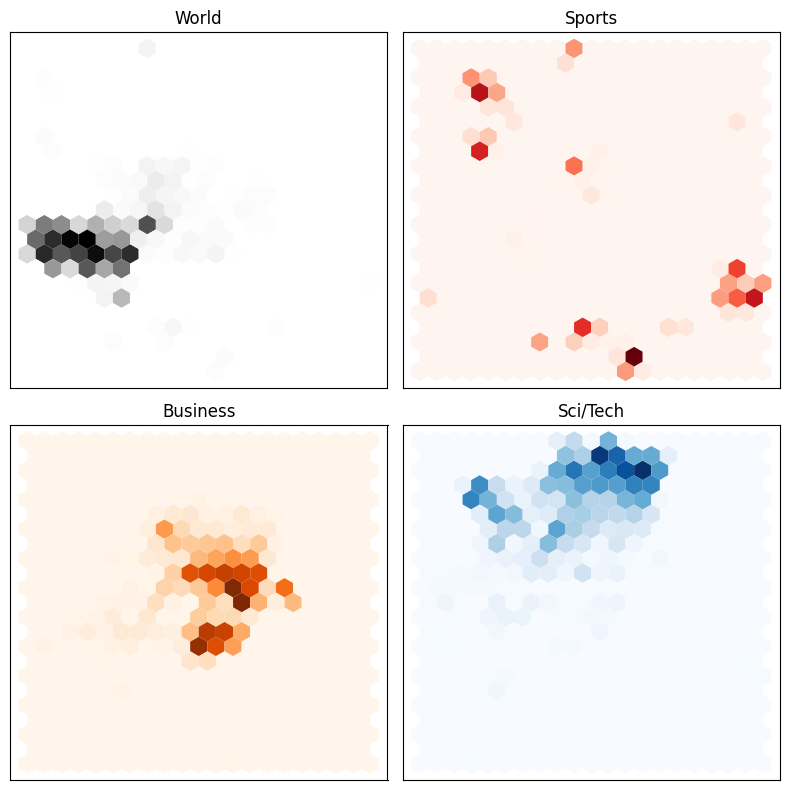

# Applying Parameter-Efficient Fine-Tuning (PEFT) to a Large Language Model (LLM)

<!--

Excalidraw:

```bash
# Log in/out to Docker Hub
docker logout
docker login

# Pull the official image (first time)
docker pull excalidraw/excalidraw

# Start app
docker run --rm -dit --name excalidraw -p 5001:80 excalidraw/excalidraw:latest
# Open browser at http://localhost:5001

# Stop
docker stop excalidraw
docker rm excalidraw
docker ps
```

Blog Post 1: How Are Large Language Models (LLMs) Built?
Subtitle: A Conceptual Guide for Developers

Blog Post 2: Applying Parameter-Efficient Fine-Tuning (PEFT) to a Large Language Model (LLM)
Subtitle: When We Need to Adapt LLMs to Specific Tasks and Domains

Blog Post 3: Retrieval Augmented Generation (RAG) with LLMs: Some Blueprints
Subtitle: How to Use External Knowledge Bases to Enhance LLM Responses

This site chronicles my observations in the fast-evolving landscape of data science.
You'll find my explorations of AI/ML topics spanning computer vision, NLP, 3D, robotics... and more.

This site chronicles my observations in the fast-evolving landscape of data science,
covering topics related to AI/ML, computer vision, NLP, 3D, robotics... and more!

-->

<p align="center">

<small style="color:grey">Two <a href="https://dl.acm.org/doi/10.1145/3442188.3445922">stochastic parrots</a> dressed up like Star Wars and Star Trek characters; same parrot, different costumes and roles. Image generated using <a href="https://openai.com/index/dall-e-3/">Dall-E 3</a>; prompt: <i> Wide landscape cartoon illustration of two red-blue-yellow macaws with sunglasses on tree branches in a bright green forest. Left parrot dressed as a Jedi with robe and blue lightsaber, right parrot dressed as a classic Star Trek Vulcan officer in a gold uniform. Bold, vibrant vector style.</i>
</small>
</p>

In my [previous post](https://mikelsagardia.io/posts/) I explained how LLMs are built, and how they work. In this post, I will try to explain how to adapt LLMs easily to specific *tasks* and *domains* using [HuggingFace's `peft` library](https://github.com/huggingface/peft). As explained in the official site, [PEFT or Parameter-Efficient Fine-Tuning](https://huggingface.co/docs/peft/en/index) is a family of techniques that

> only fine-tune a small number of (extra) model parameters &mdash; significantly decreasing computational and storage costs &mdash; while yielding performance comparable to a fully fine-tuned model. This makes it more accessible to train and store large language models (LLMs) on consumer hardware.

In summary, I cover the following topics in this post:

- What *task* and *domain* adaptation of LLMs is, and which techniques are commonly used for it.
- How PEFT/LoRA works, and how it reduces the number of trainable parameters by orders of magnitude.
- Explanation of a [Jupyter Notebook](https://github.com/mxagar/llm_peft_fine_tuning_example/blob/main/llm_peft.ipynb) that implements PEFT/LoRA on a [DistilBERT model](https://huggingface.co/docs/transformers/en/model_doc/distilbert) for a text classification task, using the [AG News](https://huggingface.co/datasets/fancyzhx/ag_news) dataset.

Let's start!

<div style="height: 20px;"></div>
<div align="center" style="border: 1px solid #e4f312ff; background-color: #fcd361b9; padding: 1em; border-radius: 6px;">
<strong>
You can find this post's accompanying code in <a href="https://github.com/mxagar/diffusion-examples/ddpm">this GitHub repository</a>. If you don't know very well how LLMs work or what embeddings are, I recommend reading my previous post <a href="https://mikelsagardia.io/posts/">How Are Large Language Models (LLMs) Built?</a> before diving into this one.
</strong>
</div>
<div style="height: 30px;"></div>

## Why and How Should We Adapt LLMs?

First of all, we should define some terminology:

- A *Task*: a specific problem we want to solve. The task is usually defined by the *input* and the *output* formats. Typically, LLMs are trained on the general task of *language modeling*: predicting the next word/token given an input sequence (i.e., the context); as such, they are able to generate coherent text related to the input. However, we can change their output layers (also known as *heads*) to perform other tasks, such as *text classification* (e.g., *sentiment analysis* and *topic classification*), *token classification* (e.g., *named entity recognition* or NER), etc.
- A *Domain*: the specific area or context to which the training texts belong and in which the task needs to be performed. Typically, LLMs are trained on a wide variety of texts from the Internet, which makes them generalists. However, we may want to adapt them to specific domains, such as *medicine*, *finance*, *legal*, etc. The more niche the domain, the more we may need to adapt the LLM to it to learn style, jargon, and specific knowledge.

This *task* and *domain* adaptation, although it is named as *fine-tuning* for LLMs, is known as *transfer learning* in the context of computer vision. It was [Howard and Ruder (2017)](https://arxiv.org/abs/1801.06146) who showed that a language model trained on a large corpus can be re-adapted for smaller corpora and other downstream tasks.

One common approach in the [PEFT](https://huggingface.co/docs/peft/en/index) library is the [Low-Rank Adaptation (or LoRA, introduced by Hu et al., 2021)](https://arxiv.org/abs/2106.09685), which I cover in more detail in the next section. In a nutshell: LoRA freezes the pre-trained weight matrices $W$ and adds to them new matrices $dW$, which are the ones that are trained. These $dW$ matrices are factored as the multiplication of two low-rank matrices; that trick reduces trainable parameters by orders of magnitude and maintains or matches full fine-tuning performance on many benchmarks.

There are other ways to adapt LLMs which I won't cover here, such as:

- [RLHF (Reinforcement Learning with Human Feedback)](https://arxiv.org/abs/2203.02155): This technique was used to align the initial ChatGPT model (GPT 3.5) with human preferences. Initially, human annotators ranked outputs of a GPT model. Then, these annotations were used to train a reward model (RM) to automatically predict the output score. And finally, the GPT model (*policy*) was trained using the [Proximal Policy Optimization (PPO) algorithm](https://en.wikipedia.org/wiki/Proximal_policy_optimization), based on the conversation history (*state*) and the outputs it produced (*actions*), and using the reward model (*reward*) as the evaluator.
- [RAG (Retrieval Augmented Generation)](https://arxiv.org/abs/2005.11401): This method consists in outsourcing the domain-specific memory of LLMs. In an offline ingestion phase, the knowledge is chunked and indexed, often as embedding vectors. In the real-time generation phase, the user asks a question, which is encoded and used to retrieve the most similar indexed chunks; then, the LLM is prompted to answer the question by using the found similar chunks, i.e., the retrieved data is injected in the query. RAGs reduce hallucinations and have been extensively implemented recently.

In my experience, usually PEFT/LoRA and RAG are the most used techniques and they can be used in combination:

- PEFT/LoRA makes sense when we need to approach a task different than *language modeling* (i.e., next token prediction), or when we have a very specific domain, such as *medicine* or *finance*, which is not well represented in the general training data of the LLM.
- RAG is more useful when we have a task that can be solved by retrieving specific information, such as *question answering* or *summarization*, and when we have a large amount of domain-specific data that changes constantly. Most chatbots that are used in production for customer support, for instance, are RAG-based.

### How Does PEFT/LoRA Work?

When we apply Low-Rank Adaptation (LoRA), we basically decompose a weight matrix into a multiplication of low-rank matrices that have fewer parameters.

Let's consider a pre-trained weight matrix $W$; instead of changing it directly, we add to it a weight offset $dW$ as follows:

$$W = W + dW,$$

where 

- $W$ represents a weight matrix of shape $(d, f)$
- and $dW$ is a weight offset to be learned, of shape $(d, f)$.

However, we do not operate directly with the weight offset $dW$; instead, we factor it as the multiplication of two low-rank matrices:

$$dW = A \cdot B,$$

where

- $A$ is of shape $(d, r)$,
- $B$ is of shape $(r, f)$,
- and $r << d, f$.

The key idea is that during training we freeze $W$ while we learn $dW$, but instead of learning the full sized $dW$, we learn the much smaller $A$ and $B$. The forward pass of the model is modified as follows:

$$y = x \cdot W = x \cdot (W + dW) = x \cdot (W + A \cdot B).$$

The proportion of weights in $dW$ as compared to $W$ is the following:

- Weights of $W$: $d \cdot f$
- Weights of $A$ and $B$: $r \cdot (d + f)$
- Proportion: $r\cdot\frac{d + f}{d \cdot f}$

Note that the number of trainable parameters is reduced by controlling the rank value $r$; for instance, if we set $r=4$, we can reduce the number of trainable parameters by more than `100x` for a weight matrix of size $(4096, 4096)$.

LoRA is not applied to all weight matrices, but usually the library (`peft`) decides where to apply it; e.g.: projection matrices $Q$ and $V$ in attention blocks, MLP layers, etc. And, after training, we can merge $W + dW$, so there is no latency added!

In addition to LoRA, **quantization** is often applied to further reduce the model size and speed up inference. Quantization consists in reducing the precision of the weights from 32-bit floating point values to 16-bit or even 4-bit integers (QLoRA); in other words, floats with high precision are represented with only `k` bits by truncating their least significant bits. This can be done using the library [bitsandbytes](https://github.com/bitsandbytes-foundation/bitsandbytes), which is very well integrated with the HuggingFace ecosystem.

## Implementation Notebook

Thanks to the [`peft`](https://github.com/huggingface/peft) library, applying PEFT/LoRA to an LLM is very easy. The [Github repository](https://github.com/mxagar/llm_peft_fine_tuning_example) I have prepared contains the Jupyter Notebook [`llm_peft.ipynb`](https://github.com/mxagar/llm_peft_fine_tuning_example/blob/main/llm_peft.ipynb), in which I provide an example.

There, I fine-tune the [DistilBERT](https://arxiv.org/abs/1910.01108) pre-trained model; DistilBERT is a smaller version of the encoder-only [BERT](https://arxiv.org/abs/1810.04805) that has been distilled to reduce its size and computational requirements, while maintaining good performance. An alternative could have been [RoBERTa](https://arxiv.org/abs/1907.11692), which was trained roughly on `10x` more data than BERT, and has approximately double the parameters than DistilBERT. We could use other models, too, e.g., generative decoder transformers like [GPT-2](https://cdn.openai.com/better-language-models/language_models_are_unsupervised_multitask_learners.pdf), although in general RoBERTa seems to have better performance for classification tasks. GPT-2 is similar in size to RoBERTa.

The dataset I use is [`ag_news`](https://huggingface.co/datasets/fancyzhx/ag_news), which consists of roughly 120,000 news texts, each of them with a label related to its associated topic: `'World', 'Sports', 'Business', 'Sci/Tech'` (perfectly balanced). Thus, the *task* head is *text classification* (with 4 mutually exclusive categories) and the *domain* is *news*.

The notebook is structured in clear sections and comments, which I won't fully reproduce here; the core steps are the following:

- Dataset splitting: I divide the 120k samples into the sets `train` (108k samples), `test` (7.6k), and `validation` (12k).
- Tokenization: The `AutoTokenizer` is instantiated with the `distilbert-base-uncased` pre-trained subword tokenizer.
- Feature exploration: some exploratory data analysis is performed.
- Model setup: the `AutoModelForSequenceClassification` is instantiated with the `distilbert-base-uncased` pre-trained model, and the `PeftModel` is instantiated with the LoRA configuration.
- Training: the `Trainer` class is instantiated with the model, the `TrainingArguments`, and the datasets; then, the `train()` method is called to start training.
- Evaluation: we use the `evaluate()` method of the `Trainer` to evaluate the model on the test set, and we compute our custom metrics (accuracy, precision, recall, and F1), as defined in `compute_metrics()`.

The feature exploration reveals that learning the classification task is going to be quite easy for the model. The function `extract_hidden_states()` is used to extract the last hidden states computed by the model, after each sample is passed through it. Then, these sample embeddings are mapped to 2D using [UMAP](https://umap-learn.readthedocs.io/en/latest/), and plotted in a hexagonal plot colored by class. As we can see, each class occupies a different region in the embedding space without any fine-tuning &mdash; that is, the model already has a good understanding of the differences between the classes.

<p align="center">

<small style="color:grey">A hexagonal plot of the embeddings from the <a href="https://huggingface.co/datasets/fancyzhx/ag_news">AG News dataset</a> according to their classes. The embeddings are the last hidden states of the <a href="https://huggingface.co/docs/transformers/en/model_doc/distilbert">DistilBERT</a> model, and they were reduced to 2D using <a href="https://umap-learn.readthedocs.io/en/latest/">UMAP</a>. Image by the author.</small>
</p>

The key aspect is the model setup for training, which is very straightforward thanks to the HuggingFace ecosystem. The code snippet below shows all the steps:

```python
# Quantization config (4-bit for minimal memory usage)
# WARNING: This requires the `bitsandbytes` library to be installed 
# and Intel CPU and/or 'cuda', 'mps', 'hpu', 'xpu', 'npu'
bnb_config = BitsAndBytesConfig(
    load_in_4bit=True,                      # Activate 4-bit quantization
    bnb_4bit_use_double_quant=True,         # Use double quantization for better accuracy
    bnb_4bit_compute_dtype="bfloat16",      # Use bf16 if supported, else float16
    bnb_4bit_quant_type="nf4",              # Quantization type: 'nf4' is best for LLMs
)

# Transformer model: we re-instantiate it to apply LoRA
# We should get a warning about the model weights not being initialized for some layers
# This is because we have appended the classifier head and we haven't trained the model yet
model = AutoModelForSequenceClassification.from_pretrained(
    "distilbert-base-uncased",
    num_labels=len(id2label),
    id2label=id2label,
    label2id=label2id,
    quantization_config=bnb_config,
    device_map="auto"  # Optional: distributes across GPUs if available
)

# LoRA configuration
# We need to check the target modules for the specific model we are using (see below)
# - For distilbert-base-uncased, we use "q_lin" and "v_lin" for the attention layers
# - For bert-base-uncased, we would use "query" and "value"
# The A*B weights are scaled with lora_alpha/r
lora_config = LoraConfig(
    r=16,                                   # Low-rank dimensionality
    lora_alpha=32,                          # Scaling factor
    target_modules=["q_lin", "v_lin"],      # Submodules to apply LoRA to (model-specific)
    lora_dropout=0.1,                       # Dropout for LoRA layers
    bias="none",                            # Do not train bias
    task_type=TaskType.SEQ_CLS              # Task type: sequence classification
)

# Get the PEFT model with LoRA
lora_model = get_peft_model(model, lora_config)

# Define training arguments
training_args = TrainingArguments(
    learning_rate=2e-3,
    weight_decay=0.01,
    num_train_epochs=1,
    eval_strategy="steps",
    save_strategy="steps",
    eval_steps=200,
    save_steps=200,
    # This seems to be a bug for PEFT models: we need to specify 'labels', not 'label'
    # as the explicit label column name
    # If we are not using PEFT, we can ignore this argument
    label_names=["labels"],  # explicitly specify label column name
    output_dir="./checkpoints",
    per_device_train_batch_size=16,
    per_device_eval_batch_size=16,
    load_best_model_at_end=True,
    logging_dir="./logs",
    report_to="tensorboard",  # enable TensorBoard, if desired
)

# Initialize the Trainer
trainer = Trainer(
    model=lora_model,  # Transformer + Adapter (LoRA)
    args=training_args,
    train_dataset=tokenized_dataset["train"],
    eval_dataset=tokenized_dataset["validation"],
    processing_class=tokenizer,
    compute_metrics=compute_metrics,
)
```

After training, the model achieves an F1 score of `0.90` on the test set (compared to `0.16` before fine-tuning), which is a very good result for this task.

Other aspects are covered in the notebook, such as:

- The training can be monitored using [TensorBoard](https://www.tensorflow.org/tensorboard).
- A `predict()` custom function is provided, which taken an input text, it tokenizes it, passes it through the model, and decodes the predicted label.
- LoRA weights are merged and the model is persisted. Merging the LoRA weights consists in computing every $dW$ and adding them to the corresponding $W$; as mentioned before, after merging, the model can be used for inference without any latency increase.
- Some error analysis is performed by looking at the misclassified samples.
- Finally, model packaging is addressed using ONNX. This is also straightforward thanks to the HuggingFace & PyTorch ecosystem, yet essential to be able to deploy the model in production.

## Summary and Conclusion

In this post, I have explained how to adapt LLMs to specific tasks and domains using Parameter-Efficient Fine-Tuning (PEFT), and more concretely, [Low-Rank Adaptation (or LoRA, introduced by Hu et al., 2021)](https://arxiv.org/abs/2106.09685). This technique allows us to train only a small number of parameters while maintaining good performance, which makes it accessible to train and store large language models on consumer hardware.

I have used the classification task applied to the [AG News](https://huggingface.co/datasets/fancyzhx/ag_news) dataset, but many more tasks are possible: token classification (e.g., named entity recognition), question answering, summarization, etc.

> Which task and domain adaptation do you have in mind?

I think that [HuggingFace](https://huggingface.co/) ecosystem is incredible, as it offers plethora of pre-trained models, datasets, and libraries that make it very easy to work with LLMs, from research to production.

If you you would like to deepen on the topic, consider checking these additional resources:

- [LoRA: Low-Rank Adaptation of Large Language Models (Hu et al., 2021)](https://arxiv.org/abs/2106.09685)
- [Hugging Face LoRA conceptual guide](https://huggingface.co/docs/peft/main/en/conceptual_guides/lora)
- [HuggingFace Guide: `mxagar/tool_guides/hugging_face`](https://github.com/mxagar/tool_guides/tree/master/hugging_face)
- My personal notes on the O'Reilly book [Natural Language Processing with Transformers, by Lewis Tunstall, Leandro von Werra and Thomas Wolf (O'Reilly)](https://github.com/mxagar/nlp_with_transformers_nbs)
- My personal notes and guide for the [Generative AI Nanodegree from Udacity](https://github.com/mxagar/generative_ai_udacity/)
